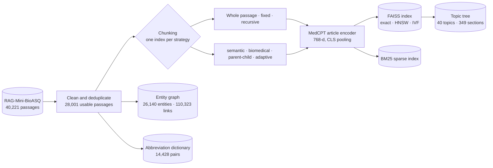
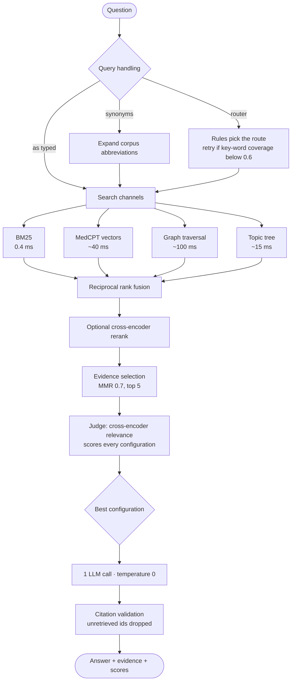

# BioRAG-X — adaptive biomedical RAG with a visible decision trail

A retrieval-augmented question answering system over ~28,000 biomedical passages that
does not assume it knows the best way to find evidence. For every question it runs about
fifteen retrieval configurations end to end, scores each one on the evidence it would put
in front of the language model, and answers using whichever configuration actually won —
then shows you the whole table, including the rows that lost.

Everything except writing the final answer runs locally and for free: chunking,
embedding, four retrieval channels, fusion, reranking and scoring. Exactly one
language-model call produces the answer, and every citation in it is verified against the
retrieved evidence.

---

## Why it is built this way

| Decision | What we chose | Why |
| --- | --- | --- |
| Embedding model | **MedCPT** (768-d, local) | Trained on 255M PubMed search interactions. Beat a generic 1,536-d hosted model on our questions, costs nothing per query, and keeps text on the machine. |
| Vector index | **Exact search** by default | 28,001 vectors is ~86 MB and exact search takes ~40 ms. Approximate indexes saved nothing measurable here and one lost 0.062 nDCG — silently. |
| Chunking | **Nine strategies, compared per question** | There is no universally right cut. A whole passage averages five findings into one vector; a 256-word window can split a negation and invert a result. So the system measures instead of asserting. |
| Retrieval | **Four channels, rank-fused** | Keyword, vector, entity-graph and topic-tree search fail in different directions. RRF needs only one channel to rank a passage well, so a weak channel is outvoted rather than switched off. |
| Query routing | **Rules, not an LLM critic** | Routing and self-correction run on rules and word coverage, so adaptivity costs milliseconds instead of a model call per question. |
| Graph | **Rule-built from the corpus** | 26k entities and 110k sentence-level links in ~10 s on CPU, each link traceable to its source passage. Honest about the limit: co-occurrence with a relation hint, not verified relation extraction. |
| Answer | **One call, temperature 0, cached, capped** | The expensive, non-deterministic step is isolated at the very end, behind a budget and a disk cache. |

---

## Architecture

### Build once, offline



### Answer a question, online



The comparison runs that whole online path once per configuration — about fifteen of them
— before a single language-model call is made.

---

## Results

Measured on a frozen 300-question development split with gold passage labels.

**Retrieval channels**

| Configuration | nDCG@10 | Latency |
| --- | --- | --- |
| BM25 only | 0.779 | 9 ms |
| Dense (MedCPT) only | 0.828 | 42 ms |
| Both, rank-fused | 0.844 | 49 ms |
| Fused + MedCPT cross-encoder rerank | **0.882** | 1.6 s |

**Vector index** — approximate search is a solution to a problem this corpus does not have:

| Index | nDCG@10 | Latency |
| --- | --- | --- |
| Exact | 0.844 | 49 ms |
| HNSW (efSearch 16) | 0.845 | 51 ms |
| IVF (nprobe 4) | 0.782 | 48 ms |

**Topic-tree retrieval** reads ~2% of the corpus per question and those sections contain
**79%** of the gold passages (45% before the coverage damping was tuned).

**The judge, measured against ground truth** on 60 questions: it picks a genuinely best
configuration **58%** of the time, mean regret 0.073 nDCG, and its per-question choice
(0.747) does not yet beat simply always using one good fixed configuration (0.753). That
number is printed in the UI rather than hidden — it is the honest ceiling on per-question
selection as implemented.

---

## What you see in the interface

- **Ask** — the trust report. Every configuration tried, its score, what it extracted,
  which one won, the answer, and every citation labelled supported / partially supported
  / unsupported. Evidence found by graph or tree search carries the path that found it.
- **Overview** — corpus, benchmark and budget counters.
- **Process flow** — five diagrams: offline build, online answer, retrieval router,
  adaptive chunking router, agentic chunking.
- **System design** — layered architecture, and a reliability view pairing each failure
  with its fallback.

The diagrams are generated by the backend from the constants the code actually runs on,
so they cannot drift from the implementation.

---

## Running it

Requires Python 3.11 and Node 18+. On Apple Silicon install `torch` and `faiss` from
conda-forge rather than pip — pip builds of each bundle their own OpenMP runtime and
crash when loaded together.

```bash
# backend
pip install -r adaptive-biomed-rag/requirements.txt
cd adaptive-biomed-rag && python -m uvicorn api.app:app --port 8000

# frontend
cd adaptive-biomed-rag/frontend && npm install && npm run dev   # http://127.0.0.1:5173
```

Copy `.env.example` to `.env` if you want generated answers. Without it everything still
runs and answers become extractive: best-matching sentences from the evidence, still
cited.

### Rebuilding the indexes

Data and indexes are not in the repository (~1.4 GB). Rebuild them in this order:

| Step | Command | Time |
| --- | --- | --- |
| 1. Canonical passages, questions, gold labels | Notebooks 01 and 02 | ~10 min |
| 2. Frozen benchmark split | `python scripts/build_benchmark.py` | seconds |
| 3. MedCPT passage vectors + FAISS | `python scripts/build_medcpt_index.py` | ~1 h on Apple GPU |
| 4. Chunk indexes per strategy | `python scripts/build_chunk_indexes.py` | hours; resumable, `--cool-down` for fanless laptops |
| 5. Graph, topic tree, abbreviations | `python scripts/build_graph_pageindex.py` | ~20 s, CPU |
| 6. Judge calibration (optional) | `python scripts/calibrate_judge.py --n 60` | ~4 min |

The source corpus is [RAG-Mini-BioASQ](https://huggingface.co/datasets/enelpol/rag-mini-bioasq),
derived from the BioASQ challenge data; notebooks 01 and 02 turn it into the canonical
passage and question tables everything else reads.

Tests: `python -m pytest tests` from `adaptive-biomed-rag/` (41 tests, no network, no
model calls).

---

## Repository layout

```
adaptive-biomed-rag/
  api/           FastAPI app, capability contract, generated architecture diagrams
  ingestion/     canonical passage and question loading
  chunking/      nine chunking strategies, the adaptive router, agentic chunking
  indexes/       BM25 (sparse matrix implementation), FAISS dense indexes, MedCPT encoders
  graph/         rule-based entity extraction and the provenance-backed evidence graph
  pageindex/     vectorless topic tree and its navigation
  retrieval/     fusion, reranking, evidence selection, judge, router, synonyms, comparison
  generation/    answer generation, structured output, citation validation
  evaluation/    retrieval and grounding metrics
  experiments/   run store and batch evaluation over the frozen splits
  scripts/       every index build, and judge calibration
  frontend/      React + TypeScript + Vite interface
Notebooks/       12 research notebooks: the experiments the thresholds come from
```

---

## Known limits

- **The judge sets the ceiling.** It scores relevance, not correctness, and agrees with
  ground truth 58% of the time. Everything downstream inherits that.
- **The graph is co-occurrence.** Two entities in one sentence, labelled with that
  sentence's relation word. No direction, no verification. Every link is traceable to its
  passage so a human can check.
- **Two chunking strategies are unfinished** (late chunking and proposition chunking).
  The interface shows them as building rather than pretending they exist.
- **Citation validation is a grounding check, not a fact check.** It drops invented
  references and flags weak grounding by word overlap; a paraphrase can be flagged, and
  word reuse can pass.
- **Single process, in-memory indexes, 12-call budget.** This is a research bench, not a
  service.

---

## Licence

MIT — see [LICENSE](LICENSE). The underlying dataset keeps its own licence and terms.
